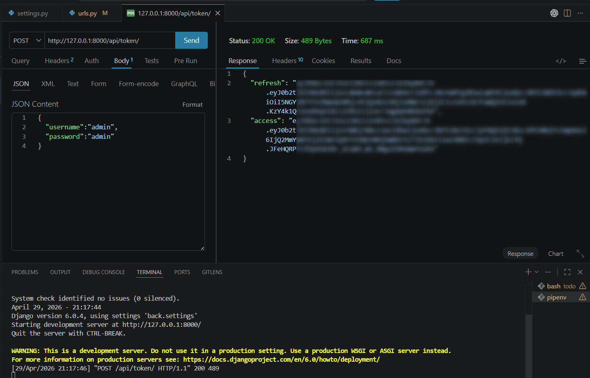
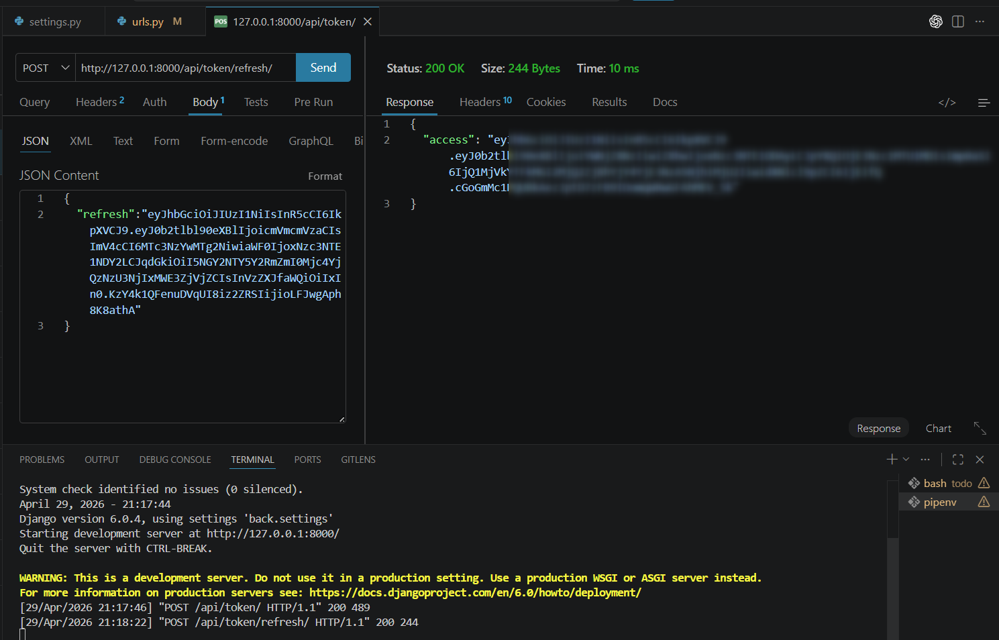

# HU35.T1 - Configurar autenticación JWT

## Objetivo
Configurar autenticación JWT en Django REST Framework para permitir el inicio de sesión mediante tokens.

## Endpoints implementados

### Obtener token

POST /api/token/

Body:
{
  "username": "admin",
  "password": "admin"
}

Resultado esperado:
- Status: 200 OK
- Retorna `access` y `refresh`

Evidencia:

---

### Refrescar token

POST /api/token/refresh/

Body:
{
  "refresh": "TOKEN_REFRESH"
}

Resultado esperado:
- Status: 200 OK
- Retorna un nuevo `access`

Evidencia:

## Resultado
La autenticación JWT quedó configurada correctamente. El backend genera tokens de acceso y refresh usando SimpleJWT.