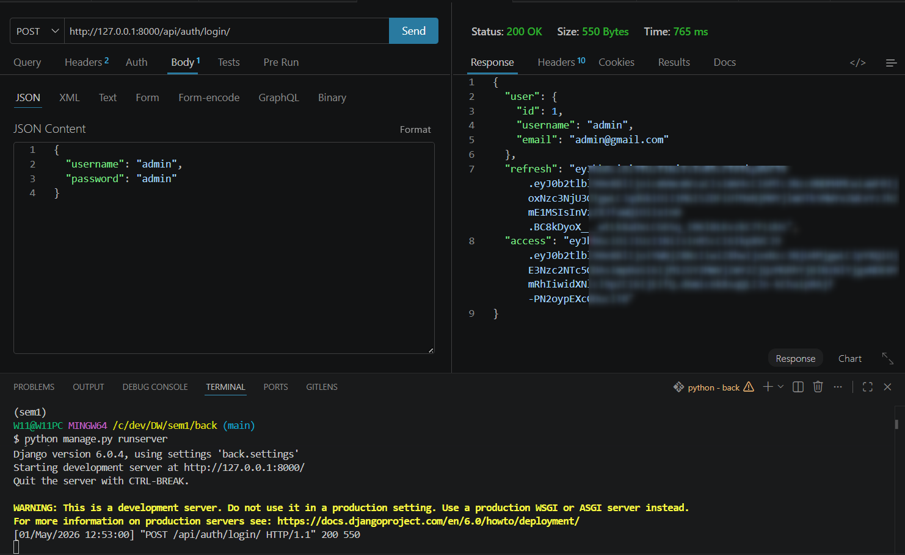
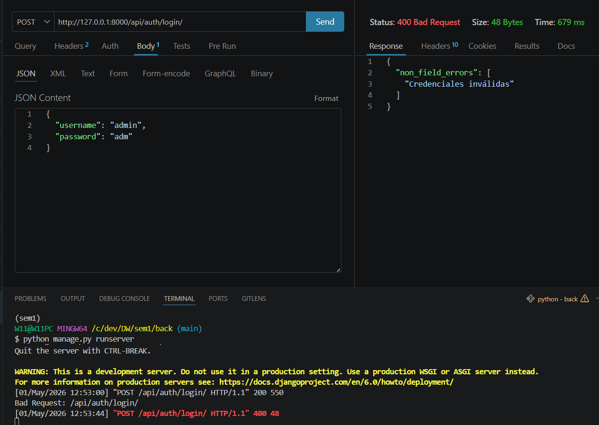

# HU35.T2 - Endpoint Login personalizado

## Objetivo
Crear un endpoint de login personalizado que permita autenticar usuarios mediante JWT, 
validando credenciales y retornando tokens de acceso y refresh junto con información básica del usuario.

---

## Endpoint

POST /api/auth/login/

---

## Request

{
  "username": "admin",
  "password": "admin"
}

---

## Response (éxito)

- Status: 200 OK  
- Retorna:
  - access
  - refresh
  - datos del usuario

Evidencia:  

---

## Response (error)

- Status: 400 Bad Request  
- Credenciales inválidas

Evidencia:  

---

## Pruebas realizadas

- Login con credenciales correctas
- Login con credenciales incorrectas
- Usuario inexistente
- Validación de campos vacíos

---

## Resultado

Se implementó un endpoint de login personalizado que valida credenciales mediante serializer y genera tokens JWT (`access` y `refresh`). El endpoint retorna información del usuario autenticado y queda listo para ser consumido por el frontend.